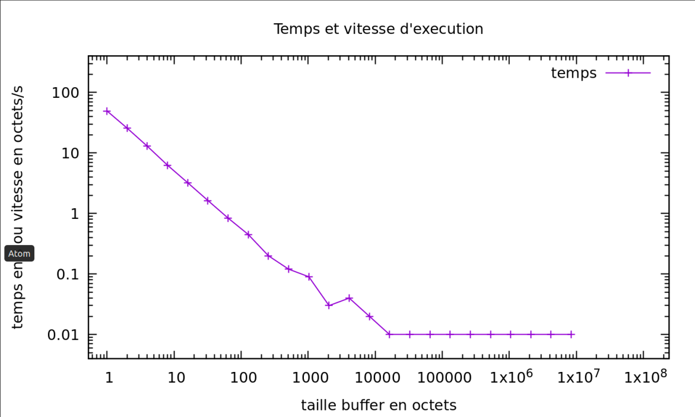
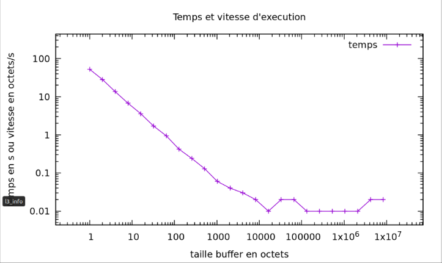

#   Performances des entrées/sorties

## Indications 

Pour commencer placez vous dans votre répertoire principale et clonez le repo : 
```bash
cd ~
git clone https://gitlab-etu.fil.univ-lille1.fr/billouard/pds-fs.git
cd pds-fs/performances/
```

Pour compiler mcat.c : 
```bash
make mcat
```
Pour tester mcat avec un buffer de taille 64 : 
```bash
./mcat 64 <mon_fichier>
```
Puis pour lancer la phase de test : 
```bash
./test.sh
```

## Protocole
Le script test.sh créer un fichier de 50 Mo et mesure le temps de lecture en fonction de la taille des buffer passé en paramètre à notre executable mcat. Il va ensuite générer les statistiques dans un fichier temporaire (final.dat) qui sera supprimé apres execution. Enfin cela affiche le graphique.

Le mcat est appelé pour lire le fichier. C'est son temps d'exécution qui est mesuré. La taille du buffer est réglable de manière à faire plusieurs tests.

Pour les tests, nous avons multiplié par deux la taille du buffer pour arriver à 8Mo en puissances de 2. 

Nouq avons avons aussi fait le choix de ne considérer seulement les veleurs 'sys' et 'user' que renvoie la commande time. 
-  user : il s'agit uniquement du temps CPU réel utilisé dans l'exécution du processus.
-  sys : est le temps CPU passé dans le noyau au sein du processus.
En effet, user+sys indique le temps réel d'utilisation du CPU du processus.  
On ne prends pas compte de real car celui si peut prendre en compte les temps utilisées par d'autres processus et le temps que le processus passe bloqué, comme attendre que les E/S se terminent.

Voici les statistiques que nous avons obtenu pour un fichier de 50Mo :  



Voici ensuite les statistiques que nous avons obtenu pour un fichier de 100Mo : 



On remarque dans le graphique que le gain de temps est conséquant et subit un arrêt brutal passé une certaine taille de buffer (entre 512 et 1024 octets). Cela signifie que augmenter sigificativement la taille du buffer n'augmente pas la vitesse d'exécution.

Il y a donc une taille de buffer optimale à avoir afin de ne pas utiliser inutilement trop de mémoire et pour lequel le gain de temps est important avant de devenir marginal.

De plus, on remarque dans le deuxième graphique pour un fichier de 100Mo la même chose avec un arrêt brutal du gain de temps. 

On peut donc dire que la taille optimale du buffer doit être définie en fonction de la taille du fichier.